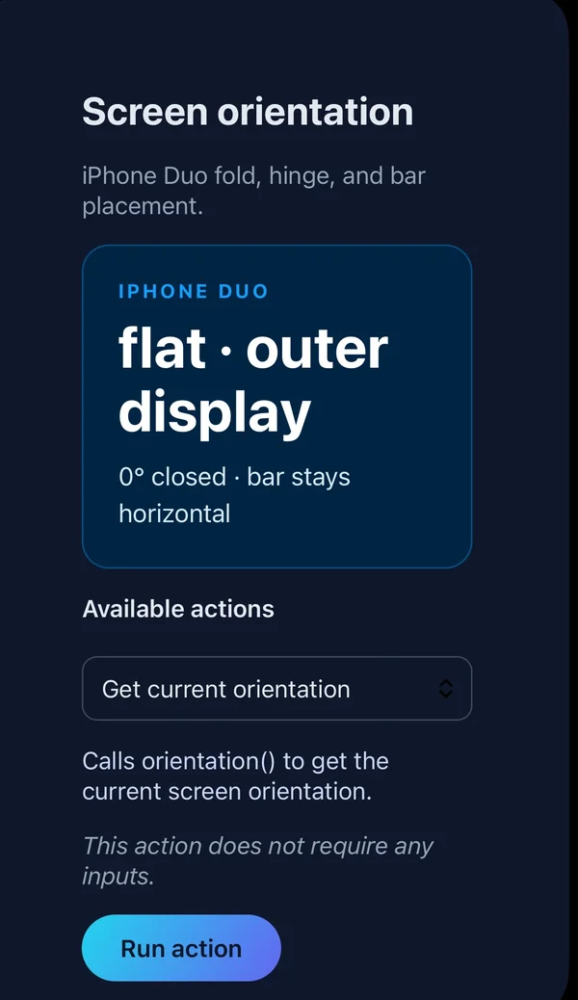

# @capgo/capacitor-screen-orientation

<a href="https://capgo.app/?ref=plugin_screen_orientation"></a>

<div align="center">
  <p><b>Capgo</b>: push fixes to your Capacitor users in minutes, build signed iOS and Android apps without a Mac, and roll back in one click.</p>
  <h2><a href="https://capgo.app/register/?ref=plugin_screen_orientation">➡️ Get started for free</a></h2>
  <p>14-day unlimited free trial. No credit card required</p>
  <p><a href="https://capgo.app/consulting/?ref=plugin_screen_orientation">Missing a feature? We'll build the plugin for you 💪</a></p>
</div>

Screen orientation plugin with support for detecting true physical device orientation

## Features

- 📱 Full Screen Orientation API support
- 🔍 **Detect true physical device orientation** using motion sensors (even when orientation lock is enabled)
  - iOS: Uses Core Motion framework
  - Android: Uses accelerometer sensor
- 🔒 **Detect if orientation lock is enabled** by comparing physical vs UI orientation
- 🔄 Real-time orientation change detection
- 🎯 Lock orientation to specific modes
- 📖 **iPhone Duo and Android foldables**: flat, book, or tabletop, hinge angle, which display is showing, and where iPhone Duo puts the tab bar
- 🌐 Web platform support

**Important Note:** This plugin can detect the physical orientation of the device using motion sensors, but it **cannot bypass the UI orientation lock**. The screen will still respect the user's orientation lock setting. This is useful for knowing how the device is physically held vs. how the UI is displayed.

## iPhone Duo

iPhone Duo (iOS 27.1 or later) is a foldable iPhone. The same fold calls used on Android report it:

| Pose | `posture` | Hinge |
| --- | --- | --- |
| Open flat, or closed on the outer display | `flat` | `180` open, `0` closed |
| Held half-open like a book | `book` | vertical hinge, about `20` to `160` |
| Propped half-open like a laptop | `tabletop` | horizontal hinge |

Closed on the cover screen, the iPhone Duo simulator reports the outer display and a hinge at 0°:



`activeDisplay` is `inner` on the large folding screen and `outer` on the cover screen. `getReservedRegions()` returns the fold (`division`) and anything covering the glass, such as the camera (`occlusion`). `getBarPlacement()` says whether iOS moved the tab bar to the side, and how wide that bar is.

A regular iPhone, and iOS before 27.1, stays `flat` with no hinge angle. Android foldables report posture and hinge angle the same way. Rear display and dual-screen modes stay on Android.

## Documentation

The most complete doc is available here: https://capgo.app/docs/plugins/screen-orientation/

## Compatibility

| Plugin version | Capacitor compatibility | Maintained |
| -------------- | ----------------------- | ---------- |
| v8.\*.\*       | v8.\*.\*                | ✅          |
| v7.\*.\*       | v7.\*.\*                | On demand   |
| v6.\*.\*       | v6.\*.\*                | ❌          |
| v5.\*.\*       | v5.\*.\*                | ❌          |

> **Note:** The major version of this plugin follows the major version of Capacitor. Use the version that matches your Capacitor installation (e.g., plugin v8 for Capacitor 8). Only the latest major version is actively maintained.

## Install

You can use our AI-Assisted Setup to install the plugin. Add the Capgo skills to your AI tool using the following command:

```bash
npx skills add https://github.com/cap-go/capacitor-skills --skill capacitor-plugins
```

Then use the following prompt:

```text
Use the `capacitor-plugins` skill from `cap-go/capacitor-skills` to install the `@capgo/capacitor-screen-orientation` plugin in my project.
```

If you prefer Manual Setup, install the plugin by running the following commands and follow the platform-specific instructions below:

```bash
npm install @capgo/capacitor-screen-orientation
npx cap sync
```

## iOS Configuration

To detect physical device orientation using motion sensors on iOS, you need to add the Motion Usage Description to your `Info.plist`:

```xml
<key>NSMotionUsageDescription</key>
<string>This app uses motion sensors to detect the true physical orientation of your device.</string>
```

Locking the screen orientation only applies to the Capacitor view controller by default. To also apply the lock to presented view controllers (for example, ones shown by the Browser plugin), add this to your app's `AppDelegate.swift`:

```swift
func application(_ application: UIApplication, supportedInterfaceOrientationsFor window: UIWindow?) -> UIInterfaceOrientationMask {
  return UIInterfaceOrientationMask(rawValue: (self.window!.rootViewController as! CAPBridgeViewController).supportedInterfaceOrientations.rawValue)
}
```

Make sure `UISupportedInterfaceOrientations` in `Info.plist` includes every orientation you want to lock to (for example landscape left/right when locking to `landscape`).

## Usage

```typescript
import { ScreenOrientation } from '@capgo/capacitor-screen-orientation';

// Get current orientation
const result = await ScreenOrientation.orientation();
console.log('Current orientation:', result.type);

// Lock to landscape
await ScreenOrientation.lock({ orientation: 'landscape' });

// Lock UI orientation and track physical orientation via motion sensors
// Note: UI will still respect user's orientation lock, but you'll get physical orientation events
await ScreenOrientation.lock({
  orientation: 'portrait',
  bypassOrientationLock: true
});

// Listen for orientation changes
const listener = await ScreenOrientation.addListener(
  'screenOrientationChange',
  (result) => {
    console.log('Orientation changed:', result.type);
  }
);

// Unlock orientation
await ScreenOrientation.unlock();

// Start motion-based tracking to detect physical device orientation
// This uses motion sensors to track how the device is actually held
await ScreenOrientation.startOrientationTracking({
  bypassOrientationLock: true
});

// Check if device orientation lock is enabled
// Compares physical device orientation (from sensors) with UI orientation (from system)
const lockStatus = await ScreenOrientation.isOrientationLocked();
if (lockStatus.locked) {
  console.log('Orientation lock is ON!');
  console.log('Physical device orientation:', lockStatus.physicalOrientation);
  console.log('UI orientation:', lockStatus.uiOrientation);
} else {
  console.log('Orientation lock is OFF or motion tracking not active');
}

// Stop motion-based tracking
await ScreenOrientation.stopOrientationTracking();

// Remove listener
await listener.remove();

// iPhone Duo and Android foldables. Flat on phones that do not fold.
const { posture, activeDisplay } = await ScreenOrientation.getFoldState();
const { angle, status } = await ScreenOrientation.getHingeAngle();
const { verticalBarEdge, inset } = await ScreenOrientation.getBarPlacement();
const { widthClass } = await ScreenOrientation.getSizeClass();
```

## API

<docgen-index>

* [`orientation()`](#orientation)
* [`lock(...)`](#lock)
* [`unlock()`](#unlock)
* [`startOrientationTracking(...)`](#startorientationtracking)
* [`stopOrientationTracking()`](#stoporientationtracking)
* [`isOrientationLocked()`](#isorientationlocked)
* [`isDeviceFoldable()`](#isdevicefoldable)
* [`getFoldState()`](#getfoldstate)
* [`getHingeAngle()`](#gethingeangle)
* [`getReservedRegions()`](#getreservedregions)
* [`getBarPlacement()`](#getbarplacement)
* [`setVerticalBarBehavior(...)`](#setverticalbarbehavior)
* [`getSizeClass()`](#getsizeclass)
* [`addListener('screenOrientationChange', ...)`](#addlistenerscreenorientationchange-)
* [`addListener('foldStateChange', ...)`](#addlistenerfoldstatechange-)
* [`addListener('hingeAngleChange', ...)`](#addlistenerhingeanglechange-)
* [`addListener('sizeClassChange', ...)`](#addlistenersizeclasschange-)
* [`removeAllListeners()`](#removealllisteners)
* [`getPluginVersion()`](#getpluginversion)
* [Interfaces](#interfaces)
* [Type Aliases](#type-aliases)

</docgen-index>

<docgen-api>
<!--Update the source file JSDoc comments and rerun docgen to update the docs below-->

Capacitor Screen Orientation Plugin interface.

Provides methods to detect and control screen orientation,
with support for detecting true physical device orientation using motion sensors.

### orientation()

```typescript
orientation() => Promise<ScreenOrientationResult>
```

Get the current screen orientation.

Returns the current orientation of the device screen.

**Returns:** <code>Promise&lt;<a href="#screenorientationresult">ScreenOrientationResult</a>&gt;</code>

**Since:** 1.0.0

--------------------


### lock(...)

```typescript
lock(options: OrientationLockOptions) => Promise<void>
```

Lock the screen orientation to a specific type.

Locks the screen to the specified orientation.
On iOS, if bypassOrientationLock is true, it will also start
tracking physical device orientation using motion sensors.

Note: The UI will still respect the user's orientation lock setting.
Motion tracking allows you to detect how the device is physically held
even when the UI doesn't rotate.

On iOS 15 there is no public API to force a rotation, so the lock restricts
the allowed orientations and the UI rotates into them when the device
orientation allows it. On iOS 16 and later the rotation is requested immediately.

| Param         | Type                                                                      | Description                          |
| ------------- | ------------------------------------------------------------------------- | ------------------------------------ |
| **`options`** | <code><a href="#orientationlockoptions">OrientationLockOptions</a></code> | Options for locking the orientation. |

**Since:** 1.0.0

--------------------


### unlock()

```typescript
unlock() => Promise<void>
```

Unlock the screen orientation.

Allows the screen to rotate freely based on device position.
Also stops any motion-based orientation tracking if it was enabled.

**Since:** 1.0.0

--------------------


### startOrientationTracking(...)

```typescript
startOrientationTracking(options?: StartOrientationTrackingOptions | undefined) => Promise<void>
```

Start tracking device orientation using motion sensors.

This method is useful when you want to track the device's physical
orientation independently from the screen orientation lock.
It uses Core Motion on iOS to detect orientation changes.

| Param         | Type                                                                                        | Description                                |
| ------------- | ------------------------------------------------------------------------------------------- | ------------------------------------------ |
| **`options`** | <code><a href="#startorientationtrackingoptions">StartOrientationTrackingOptions</a></code> | Options for starting orientation tracking. |

**Since:** 1.0.0

--------------------


### stopOrientationTracking()

```typescript
stopOrientationTracking() => Promise<void>
```

Stop tracking device orientation using motion sensors.

Stops the motion-based orientation tracking if it was started.

**Since:** 1.0.0

--------------------


### isOrientationLocked()

```typescript
isOrientationLocked() => Promise<OrientationLockStatusResult>
```

Check if device orientation lock is currently enabled.

This method compares the physical device orientation (from motion sensors)
with the UI orientation. If they differ, orientation lock is enabled.

Note: This requires motion tracking to be active via
startOrientationTracking() or lock() with bypassOrientationLock: true.
Works on both iOS (Core Motion) and Android (Accelerometer).

**Returns:** <code>Promise&lt;<a href="#orientationlockstatusresult">OrientationLockStatusResult</a>&gt;</code>

**Since:** 1.0.0

--------------------


### isDeviceFoldable()

```typescript
isDeviceFoldable() => Promise<DeviceFoldableResult>
```

Whether this device folds, and whether it can stand half-open like a laptop.

Both flags are `false` on web, on Android phones that do not fold, and on iOS except iPhone Duo (iOS 27.1 or later).

**Returns:** <code>Promise&lt;<a href="#devicefoldableresult">DeviceFoldableResult</a>&gt;</code>

**Since:** 8.2.0

--------------------


### getFoldState()

```typescript
getFoldState() => Promise<FoldState>
```

Read the current fold.

Resolves to a flat state when the device has no fold.

**Returns:** <code>Promise&lt;<a href="#foldstate">FoldState</a>&gt;</code>

**Since:** 8.2.0

--------------------


### getHingeAngle()

```typescript
getHingeAngle() => Promise<HingeAngleResult>
```

Read the hinge angle in degrees.

`0` is closed and `180` is flat. `angle` is `null` without a hinge sensor.

**Returns:** <code>Promise&lt;<a href="#hingeangleresult">HingeAngleResult</a>&gt;</code>

**Since:** 8.2.0

--------------------


### getReservedRegions()

```typescript
getReservedRegions() => Promise<{ regions: ReservedRegion[]; }>
```

Read the fold and anything covering the screen.

iPhone Duo reports the fold, the vertical status bar area, and the under-display camera.
Resolves to an empty list on Android, web, and iOS before 27.1.

**Returns:** <code>Promise&lt;{ regions: ReservedRegion[]; }&gt;</code>

**Since:** 8.2.0

--------------------


### getBarPlacement()

```typescript
getBarPlacement() => Promise<BarPlacement>
```

Read where iPhone Duo puts native tab bars and toolbars.

`verticalBarEdge` is `null` when bars stay horizontal, and always on Android and web.

**Returns:** <code>Promise&lt;<a href="#barplacement">BarPlacement</a>&gt;</code>

**Since:** 8.2.0

--------------------


### setVerticalBarBehavior(...)

```typescript
setVerticalBarBehavior(options: { behavior: 'automatic' | 'disabled'; }) => Promise<{ applied: boolean; }>
```

Choose whether iPhone Duo may move this app's bars to the side.

Resolves to `{ applied: false }` unless the app's bridge view controller opts in.
Android and web always resolve to `{ applied: false }`.

| Param         | Type                                                  | Description                                                              |
| ------------- | ----------------------------------------------------- | ------------------------------------------------------------------------ |
| **`options`** | <code>{ behavior: 'automatic' \| 'disabled'; }</code> | `automatic` lets the system move bars. `disabled` keeps them horizontal. |

**Returns:** <code>Promise&lt;{ applied: boolean; }&gt;</code>

**Since:** 8.2.0

--------------------


### getSizeClass()

```typescript
getSizeClass() => Promise<SizeClass>
```

Read the window size classes.

**Returns:** <code>Promise&lt;<a href="#sizeclass">SizeClass</a>&gt;</code>

**Since:** 8.2.0

--------------------


### addListener('screenOrientationChange', ...)

```typescript
addListener(eventName: 'screenOrientationChange', listenerFunc: (result: ScreenOrientationResult) => void) => Promise<PluginListenerHandle>
```

| Param              | Type                                                                                             |
| ------------------ | ------------------------------------------------------------------------------------------------ |
| **`eventName`**    | <code>'screenOrientationChange'</code>                                                           |
| **`listenerFunc`** | <code>(result: <a href="#screenorientationresult">ScreenOrientationResult</a>) =&gt; void</code> |

**Returns:** <code>Promise&lt;<a href="#pluginlistenerhandle">PluginListenerHandle</a>&gt;</code>

--------------------


### addListener('foldStateChange', ...)

```typescript
addListener(eventName: 'foldStateChange', listenerFunc: (state: FoldState) => void) => Promise<PluginListenerHandle>
```

Listen for fold changes.

On a foldable this also fires when the device rotates, because the hinge
bounds rotate with the window.

| Param              | Type                                                                | Description                                |
| ------------------ | ------------------------------------------------------------------- | ------------------------------------------ |
| **`eventName`**    | <code>'foldStateChange'</code>                                      | The event name. Must be 'foldStateChange'. |
| **`listenerFunc`** | <code>(state: <a href="#foldstate">FoldState</a>) =&gt; void</code> | Callback invoked with the new fold state.  |

**Returns:** <code>Promise&lt;<a href="#pluginlistenerhandle">PluginListenerHandle</a>&gt;</code>

**Since:** 8.2.0

--------------------


### addListener('hingeAngleChange', ...)

```typescript
addListener(eventName: 'hingeAngleChange', listenerFunc: (event: HingeAngleResult) => void) => Promise<PluginListenerHandle>
```

Listen for hinge angle changes.

On Android the hinge sensor runs only while at least one listener is registered.
On iOS this fires on iPhone Duo (iOS 27.1 or later). Never fires on web.

| Param              | Type                                                                              | Description                                 |
| ------------------ | --------------------------------------------------------------------------------- | ------------------------------------------- |
| **`eventName`**    | <code>'hingeAngleChange'</code>                                                   | The event name. Must be 'hingeAngleChange'. |
| **`listenerFunc`** | <code>(event: <a href="#hingeangleresult">HingeAngleResult</a>) =&gt; void</code> | Callback invoked with the angle in degrees. |

**Returns:** <code>Promise&lt;<a href="#pluginlistenerhandle">PluginListenerHandle</a>&gt;</code>

**Since:** 8.2.0

--------------------


### addListener('sizeClassChange', ...)

```typescript
addListener(eventName: 'sizeClassChange', listenerFunc: (sizeClass: SizeClass) => void) => Promise<PluginListenerHandle>
```

Listen for size class changes, such as unfolding, rotating, or resizing.

| Param              | Type                                                                    | Description                                |
| ------------------ | ----------------------------------------------------------------------- | ------------------------------------------ |
| **`eventName`**    | <code>'sizeClassChange'</code>                                          | The event name. Must be 'sizeClassChange'. |
| **`listenerFunc`** | <code>(sizeClass: <a href="#sizeclass">SizeClass</a>) =&gt; void</code> | Callback invoked with the new size class.  |

**Returns:** <code>Promise&lt;<a href="#pluginlistenerhandle">PluginListenerHandle</a>&gt;</code>

**Since:** 8.2.0

--------------------


### removeAllListeners()

```typescript
removeAllListeners() => Promise<void>
```

Remove all listeners for this plugin.

Removes all registered event listeners.

**Since:** 1.0.0

--------------------


### getPluginVersion()

```typescript
getPluginVersion() => Promise<{ version: string; }>
```

Get the native plugin version.

Returns the current version of the native plugin implementation.

**Returns:** <code>Promise&lt;{ version: string; }&gt;</code>

**Since:** 1.0.0

--------------------


### Interfaces


#### ScreenOrientationResult

Result returned by the orientation() method.

| Prop       | Type                                                        | Description                   | Since |
| ---------- | ----------------------------------------------------------- | ----------------------------- | ----- |
| **`type`** | <code><a href="#orientationtype">OrientationType</a></code> | The current orientation type. | 1.0.0 |


#### OrientationLockOptions

Options for locking the screen orientation.

| Prop                        | Type                                                                | Description                                                                                                                                                                                                                                                                                                                                                                                                                                                                                                                                                                                                             | Default            | Since |
| --------------------------- | ------------------------------------------------------------------- | ----------------------------------------------------------------------------------------------------------------------------------------------------------------------------------------------------------------------------------------------------------------------------------------------------------------------------------------------------------------------------------------------------------------------------------------------------------------------------------------------------------------------------------------------------------------------------------------------------------------------- | ------------------ | ----- |
| **`orientation`**           | <code><a href="#orientationlocktype">OrientationLockType</a></code> | The orientation type to lock to.                                                                                                                                                                                                                                                                                                                                                                                                                                                                                                                                                                                        |                    | 1.0.0 |
| **`bypassOrientationLock`** | <code>boolean</code>                                                | Whether to track physical device orientation using motion sensors. When true, uses device motion sensors to detect the true physical orientation of the device, even when the device orientation lock is enabled. **Important:** This does NOT bypass the UI orientation lock. The screen will still respect the user's orientation lock setting. This option only affects orientation detection/tracking - you'll receive orientation change events based on how the device is physically held, but the UI will not rotate if orientation lock is enabled. Supported on iOS (Core Motion) and Android (Accelerometer). | <code>false</code> | 1.0.0 |


#### StartOrientationTrackingOptions

Options for starting orientation tracking using motion sensors.

| Prop                        | Type                 | Description                                                                                                                                                                                                                                                                                                                                                                                         | Default            | Since |
| --------------------------- | -------------------- | --------------------------------------------------------------------------------------------------------------------------------------------------------------------------------------------------------------------------------------------------------------------------------------------------------------------------------------------------------------------------------------------------- | ------------------ | ----- |
| **`bypassOrientationLock`** | <code>boolean</code> | Whether to track physical device orientation using motion sensors. When true, uses device motion sensors to detect the true physical orientation of the device, even when the device orientation lock is enabled. **Important:** This does NOT bypass the UI orientation lock. This only enables detection of the physical orientation. Supported on iOS (Core Motion) and Android (Accelerometer). | <code>false</code> | 1.0.0 |


#### OrientationLockStatusResult

Result returned by the isOrientationLocked() method.

| Prop                      | Type                                                        | Description                                                                                                                                                                                                                                                                                                      | Since |
| ------------------------- | ----------------------------------------------------------- | ---------------------------------------------------------------------------------------------------------------------------------------------------------------------------------------------------------------------------------------------------------------------------------------------------------------- | ----- |
| **`locked`**              | <code>boolean</code>                                        | Whether the device orientation lock is currently enabled. This is determined by comparing the physical device orientation (from motion sensors) with the UI orientation. If they differ, orientation lock is enabled. Available on iOS (Core Motion) and Android (Accelerometer) when motion tracking is active. | 1.0.0 |
| **`physicalOrientation`** | <code><a href="#orientationtype">OrientationType</a></code> | The physical orientation of the device from motion sensors. Available when motion tracking is active (iOS and Android).                                                                                                                                                                                          | 1.0.0 |
| **`uiOrientation`**       | <code><a href="#orientationtype">OrientationType</a></code> | The current UI orientation reported by the system.                                                                                                                                                                                                                                                               | 1.0.0 |


#### DeviceFoldableResult

Whether this device can fold.

| Prop                   | Type                 | Description                                   | Since |
| ---------------------- | -------------------- | --------------------------------------------- | ----- |
| **`foldable`**         | <code>boolean</code> | Whether the device has a fold.                | 8.2.0 |
| **`supportsTabletop`** | <code>boolean</code> | Whether it can stand half-open like a laptop. | 8.2.0 |


#### FoldState

Current fold of the window.

Phones that do not fold, and iOS before 27.1, resolve to a flat state.
iPhone Duo reports `book`, `tabletop`, or `flat`, and which display is in front.

| Prop                   | Type                                                                       | Description                                                                                                         | Since |
| ---------------------- | -------------------------------------------------------------------------- | ------------------------------------------------------------------------------------------------------------------- | ----- |
| **`state`**            | <code><a href="#foldstatevalue">FoldStateValue</a></code>                  | Posture of the fold.                                                                                                | 8.2.0 |
| **`isSeparating`**     | <code>boolean</code>                                                       | Whether the fold splits the web view into two areas.                                                                | 8.2.0 |
| **`posture`**          | <code><a href="#foldposture">FoldPosture</a></code>                        | How the device is held.                                                                                             | 8.2.0 |
| **`hingeOrientation`** | <code><a href="#hingeorientation">HingeOrientation</a></code>              | Direction of the hinge. Omitted when there is no fold.                                                              | 8.2.0 |
| **`hingeBounds`**      | <code><a href="#foldbounds">FoldBounds</a></code>                          | Position of the fold in CSS pixels. Omitted when there is no fold.                                                  | 8.2.0 |
| **`occludedBounds`**   | <code><a href="#foldbounds">FoldBounds</a></code>                          | Area the hinge covers. Present when the hinge has a physical gap.                                                   | 8.2.0 |
| **`activeDisplay`**    | <code>'inner' \| 'outer'</code>                                            | Which display is showing the app on iPhone Duo. Omitted on Android, web, and iOS before 27.1.                       | 8.2.0 |
| **`hingeMargins`**     | <code>{ top: number; right: number; bottom: number; left: number; }</code> | Space the system keeps clear around the fold, in CSS pixels. iPhone Duo reports 20 on each side of a vertical fold. | 8.2.0 |
| **`cameraBounds`**     | <code>FoldBounds[]</code>                                                  | Areas covering the display, such as the iPhone Duo camera. Omitted when there are none.                             | 8.2.0 |


#### FoldBounds

A rectangle in CSS pixels, relative to the web view.

| Prop         | Type                |
| ------------ | ------------------- |
| **`x`**      | <code>number</code> |
| **`y`**      | <code>number</code> |
| **`width`**  | <code>number</code> |
| **`height`** | <code>number</code> |


#### HingeAngleResult

Angle between the two halves of a foldable, in degrees.

`0` is closed and `180` is flat. `angle` is `null` when the device has no hinge sensor.

| Prop         | Type                                                            | Description                                                                   | Since |
| ------------ | --------------------------------------------------------------- | ----------------------------------------------------------------------------- | ----- |
| **`angle`**  | <code>number \| null</code>                                     | Hinge angle in degrees, or `null` when no sensor is available.                | 8.2.0 |
| **`status`** | <code>'closed' \| 'partiallyOpen' \| 'fullyOpen' \| null</code> | How far open iPhone Duo is, as the system sees it. `null` on Android and web. | 8.2.0 |


#### ReservedRegion

A region the system reserves on iPhone Duo.

`division` is the fold. `occlusion` is something covering the display, such as the camera.

| Prop           | Type                                                                       | Description                                                                | Since |
| -------------- | -------------------------------------------------------------------------- | -------------------------------------------------------------------------- | ----- |
| **`kind`**     | <code>'division' \| 'occlusion'</code>                                     | What the region is.                                                        | 8.2.0 |
| **`isActive`** | <code>boolean</code>                                                       | Whether the region applies right now. An inactive division is a flat fold. | 8.2.0 |
| **`x`**        | <code>number</code>                                                        | Left edge, in CSS pixels.                                                  | 8.2.0 |
| **`y`**        | <code>number</code>                                                        | Top edge, in CSS pixels.                                                   | 8.2.0 |
| **`width`**    | <code>number</code>                                                        | Width in CSS pixels.                                                       | 8.2.0 |
| **`height`**   | <code>number</code>                                                        | Height in CSS pixels.                                                      | 8.2.0 |
| **`margins`**  | <code>{ top: number; right: number; bottom: number; left: number; }</code> | Space to keep clear around the region, in CSS pixels.                      | 8.2.0 |


#### BarPlacement

Where iPhone Duo places native bars.

| Prop                  | Type                                         | Description                                                                           | Since |
| --------------------- | -------------------------------------------- | ------------------------------------------------------------------------------------- | ----- |
| **`verticalBarEdge`** | <code>'leading' \| 'trailing' \| null</code> | The edge the system moves tab bars and toolbars to. `null` when they stay horizontal. | 8.2.0 |
| **`inset`**           | <code>number</code>                          | How much room the vertical bar takes, in points. `0` when bars stay horizontal.       | 8.2.0 |


#### SizeClass

Window size classes.

`horizontal` and `vertical` follow Apple's compact/regular split.
On Android and web, `regular` starts at 600 CSS pixels wide and 480 tall.
`widthClass` and `heightClass` follow Material window size classes.

| Prop              | Type                                                                        | Description                                                                                                                               | Since |
| ----------------- | --------------------------------------------------------------------------- | ----------------------------------------------------------------------------------------------------------------------------------------- | ----- |
| **`horizontal`**  | <code>'compact' \| 'regular'</code>                                         | Width size class. `compact` on a phone, `regular` on the inner display of a foldable, a tablet, or a window at least 600 CSS pixels wide. | 8.2.0 |
| **`vertical`**    | <code>'compact' \| 'regular'</code>                                         | Height size class. `regular` starts at 480 CSS pixels.                                                                                    | 8.2.0 |
| **`widthClass`**  | <code>'compact' \| 'medium' \| 'expanded' \| 'large' \| 'extraLarge'</code> | Material window width class.                                                                                                              | 8.2.0 |
| **`heightClass`** | <code>'compact' \| 'medium' \| 'expanded'</code>                            | Material window height class.                                                                                                             | 8.2.0 |


#### PluginListenerHandle

| Prop         | Type                                      |
| ------------ | ----------------------------------------- |
| **`remove`** | <code>() =&gt; Promise&lt;void&gt;</code> |


### Type Aliases


#### OrientationType

Orientation type that describes the orientation state of the device.

<code>'portrait-primary' | 'portrait-secondary' | 'landscape-primary' | 'landscape-secondary'</code>


#### OrientationLockType

Orientation lock type that can be used to lock the device orientation.

<code>'any' | 'natural' | 'landscape' | 'portrait' | 'portrait-primary' | 'portrait-secondary' | 'landscape-primary' | 'landscape-secondary'</code>


#### FoldStateValue

How open a foldable is.

`closed` is reserved. A device shut onto its cover display reports `flat`.

<code>'flat' | 'half-opened'</code>


#### FoldPosture

How a half-open foldable is held.

`tabletop` is a horizontal hinge, like a laptop. `book` is a vertical hinge.

<code>'flat' | 'tabletop' | 'book'</code>


#### HingeOrientation

Direction of the hinge relative to the window.

<code>'horizontal' | 'vertical'</code>

</docgen-api>
